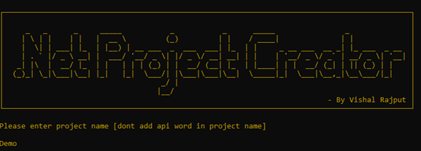
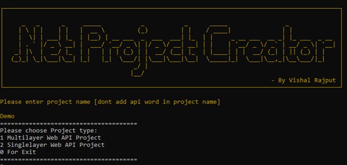
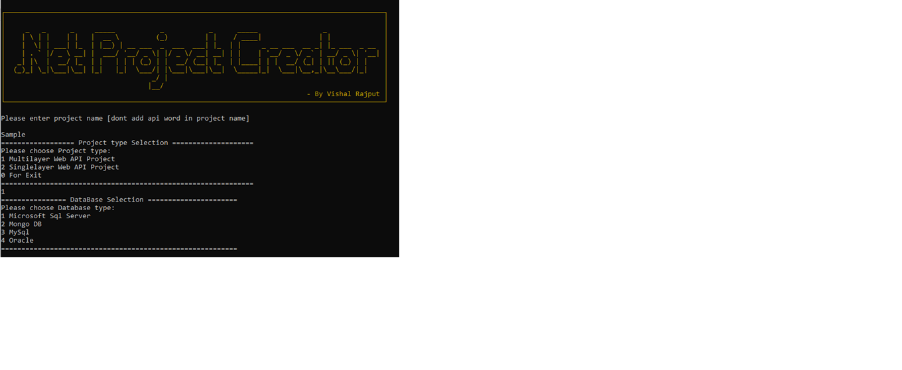
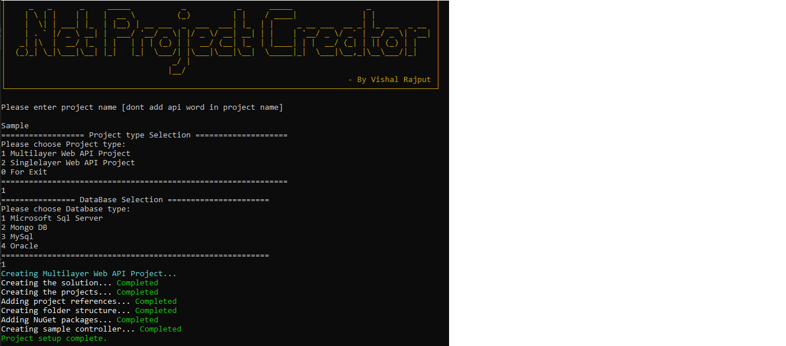

# Dotnet Web API Project Skeleton Generator

Welcome to the Dotnet Web API Project Skeleton Generator! This tool helps you quickly set up a new Dotnet Web API project with a clean and organized structure. You can choose between generating a multilayer project or a single-layer project.

## Features

- **Global Exception Middleware**: Provides a global exception handling mechanism to ensure consistent error responses.
- **ResponseHelper**: Simplifies controller code and enhances readability by reducing repetitive code.
- **Serilog Integration**: Adds robust logging capabilities with Serilog, ensuring proper logging throughout your application.
- **Default DB Connection Configuration**: Pre-configured database connection settings in `appsettings.json`.
- **DapperContext**: Automatically creates a database connection using Dapper, eliminating the need for manual configuration.
- **Response Compression**: Enhances performance by compressing the response data sent to clients.
- **Security Headers**: Adds security headers to HTTP responses to enhance the application's security.
- **Multiple Database Support**: Offers seamless integration with multiple databases, including:
  - **MS-SQL**: Support for Microsoft SQL Server.
  - **MongoDB**: Support for MongoDB.
  - **MySQL**: Support for MySQL.
  - **Oracle**: Support for Oracle.

## Steps to Generate a Project

1. **Run the Executable**: Start the tool by running the executable.

2. **Enter Project Name**: Provide a name for your new project.

    

3. **Choose Project Type**:
    - **1** for Multilayer Project
    - **2** for Single Layer Project

    

4. **Choose Database Type**:
    - **1** for MsSQL Server
    - **2** for Mongo DB
    - **3** for MySQL
    - **4** for Oracle

    

5. **Generate the Solution**: The tool will generate the necessary files and structure for your chosen project type.

    

